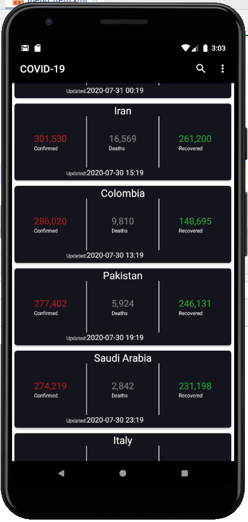
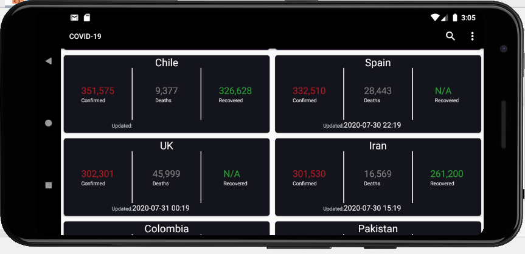
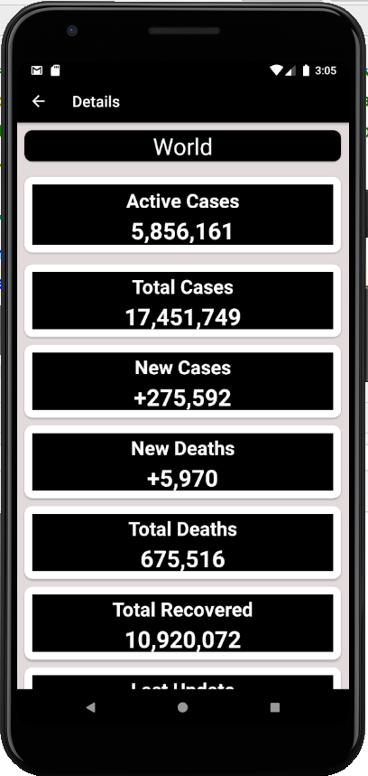

# COVID-19-Info
- This Application trackers The new COVID-19 data around the world produce last updated information about each country  affected by the virus like: Active Cases, Total Cases, New     Cases, New Deaths, Total Deaths and Recovered Case
- Search by country name.

# Technologies
- MVVM design pattern
- Singleton design pattern
- REST APIs (Rertrofit library)

# Screenshots

